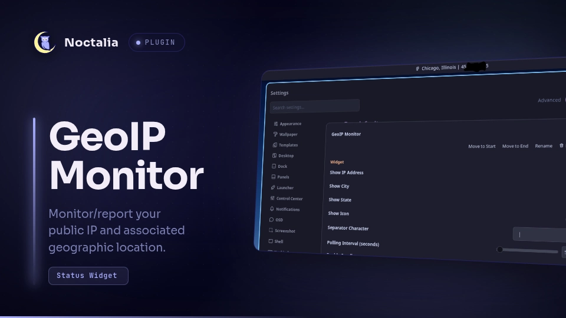

# GeoIP Monitor

A lightweight status bar widget for Noctalia that displays your external IP address and geographical location (City, State/Region). It utilizes an efficient two-tier polling system to monitor for network changes without spamming rate-limited APIs.

## Plugin

| Field | Value |
| --- | --- |
| ID | `pk/geoip-monitor` |
| Entries | Bar widget: `status` |

## Requirements

Install `curl` on `PATH`.

## Usage

To add to your bar, navigate to:
**Noctalia Settings** > **Bar:** / **Widget List** > Add/modify "GeoIP Monitor".


Left-clicking the widget on your status bar will immediately clear the local cache and force a manual network refresh.

```sh
noctalia msg panel-toggle pk/ip-monitor

noctalia msg plugins enable pk/ip-monitor

noctalia msg plugins disable pk/ip-monitor
```

## Settings

| Setting | Type | Default | Description |
| --- | --- | --- | --- |
| `show_ip` | `boolean` | `true` | Toggles the display of the external IP address.|
| `show_city` | `boolean` | `true` | Toggles the display of the city name.|
| `show_state` | `boolean` | `true` | Toggles the display of the state or region name.|
| `show_icon` | `boolean` | `true` | Toggles the visibility of the globe icon in the status bar.|
| `separator` | `string` | `" \| "` | Separation between text and IP.|
| `interval` | `int` | `5` | The frequency (in seconds) to poll for IP changes. Min: 1, Max: 3600.|

## Notes



* **Network Access:** This plugin spawns background `curl` processes to make outbound HTTPS requests to `api.ipify.org` and `ipwho.is`.


* **Rate Limiting Safeguards:** The plugin heavily caches results. It polls `api.ipify.org` at your defined interval as a lightweight tripwire, and only queries the heavier `ipwho.is` geolocation database when a new IP is actually detected.

## How it works:
1. Queryies https://api.ipify.org for your external IP at the configured interval.
- This site has no limit on queries per day, but only provides IP.

2. If the IP changes, https://ipwho.is is queried for geographic and IP data.  This site limits queries to 1000 per 24hr without api key.  This data is:
- Stored in the cache for continual display until the IP changes.
- Refreshed from cache until a new IP is detected via api.ipify.org.


