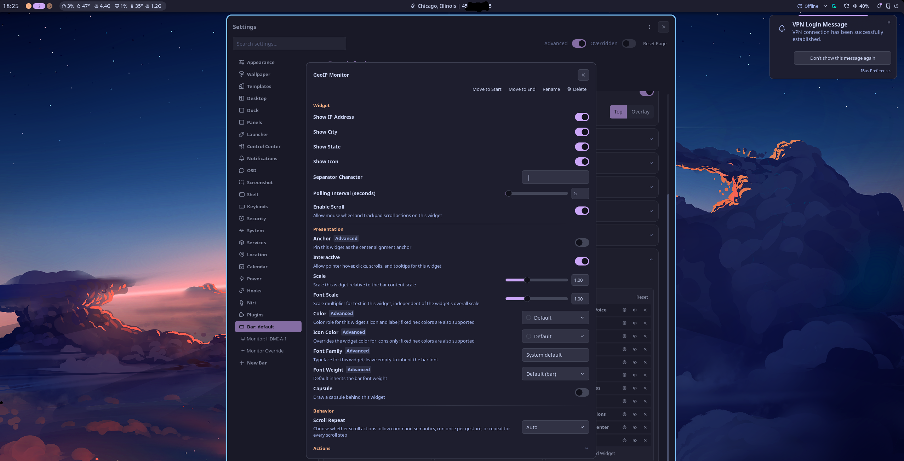

# GeoIP Monitor Plugin for Noctalia

A lightweight, configurable status bar widget for Noctalia Shell that displays your external IP address and geographical location (City, State/Region) with real-time polling and instant manual cache refresh.

---


## How it works:
1. Queryies https://api.ipify.org for your external IP at the configured interval and notes it in a cache.
- This site has no limit on queries per day, but only provides IP.

2. If the IP changes from the cache, it https://ipwho.is is queried for geographic and IP data.  This site limits queries to 1000 per 24hr without api key.  This data is:
- Stored in the cache for continual display until the IP changes.
- Is not refreshed from cache unless a new IP is detected via api.ipify.org.

---


---

## Requirements

- curl
- Network access to https://api.ipify.org, https://ipwho.is

---

## Features

- **Granular Display Toggles**: Independently show or hide IP address, City, and State.
- **Icon Visibility Control**: Toggle the status bar icon (`globe`) on or off dynamically without layout collapse.
- **Custom Delimiter**: Configure any custom separator string between location and IP text (default: ` | `).
- **Adjustable Polling Interval**: Configure poll rates from 1 to 3600 seconds via a graphical slider or configuration file.
- **Click-to-Refresh**: Clicking the widget immediately clears local caches and triggers a fresh network query.
- **Reliable Geo-Lookup**: Queries `ipwho.is` asynchronously to prevent UI freezing and ensure accurate ISP/regional attribution without requiring an API key.
- **Declarative UI**: Built using Noctalia v5's declarative `barWidget.render()` engine, automatically adapting between horizontal and vertical bar orientations.


---

## Enabling and Managing

After placing the files, load and enable the plugin via Noctalia's IPC interface:

```bash
noctalia msg plugins disable pk/ip-monitor
noctalia msg plugins enable pk/ip-monitor
```

To configure options visually, use your middle mouse button to click on the widget.

To add to your bar, navigate to:
**Noctalia Settings** > **Bar:** / **Widget List** > Add/modify GeoIP Monitor.

---

